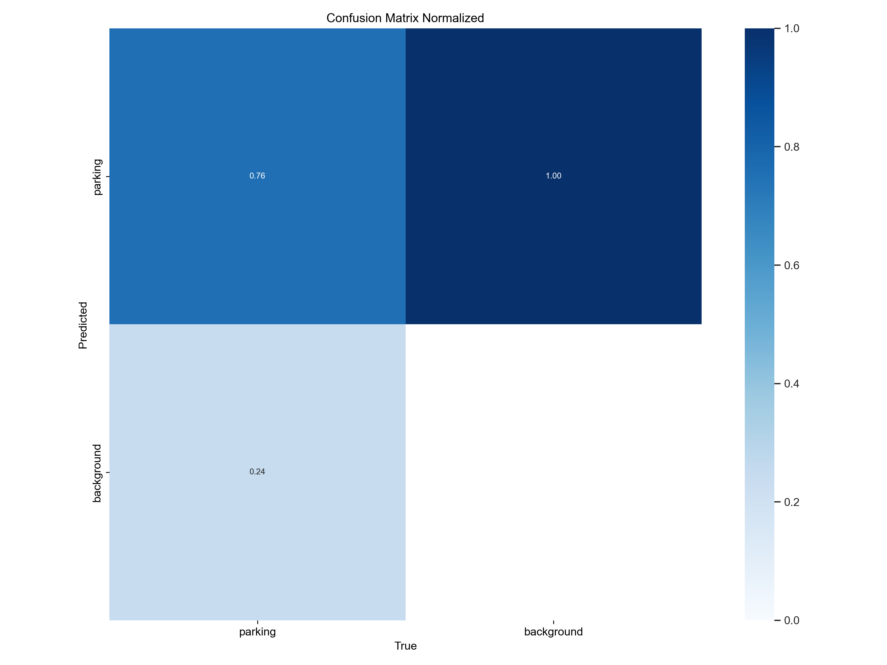
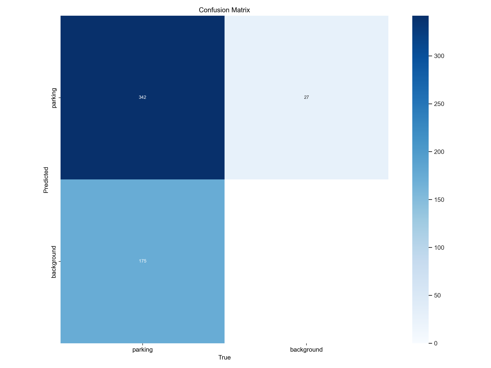
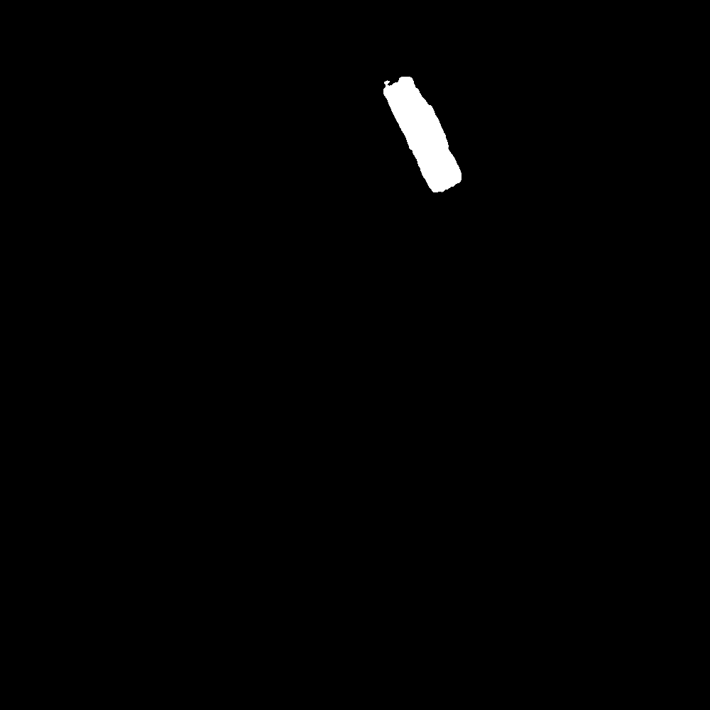
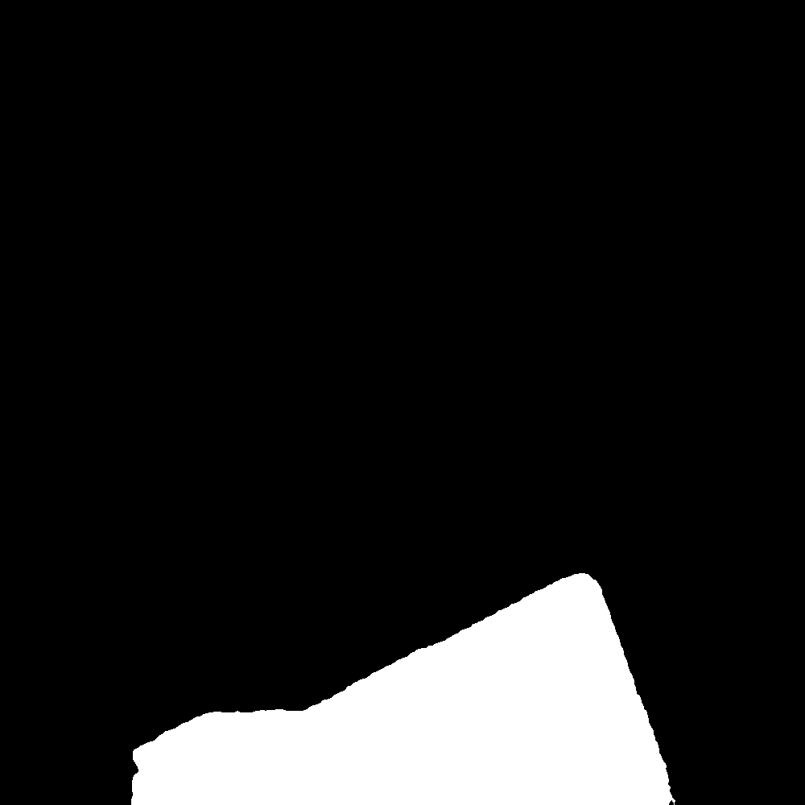
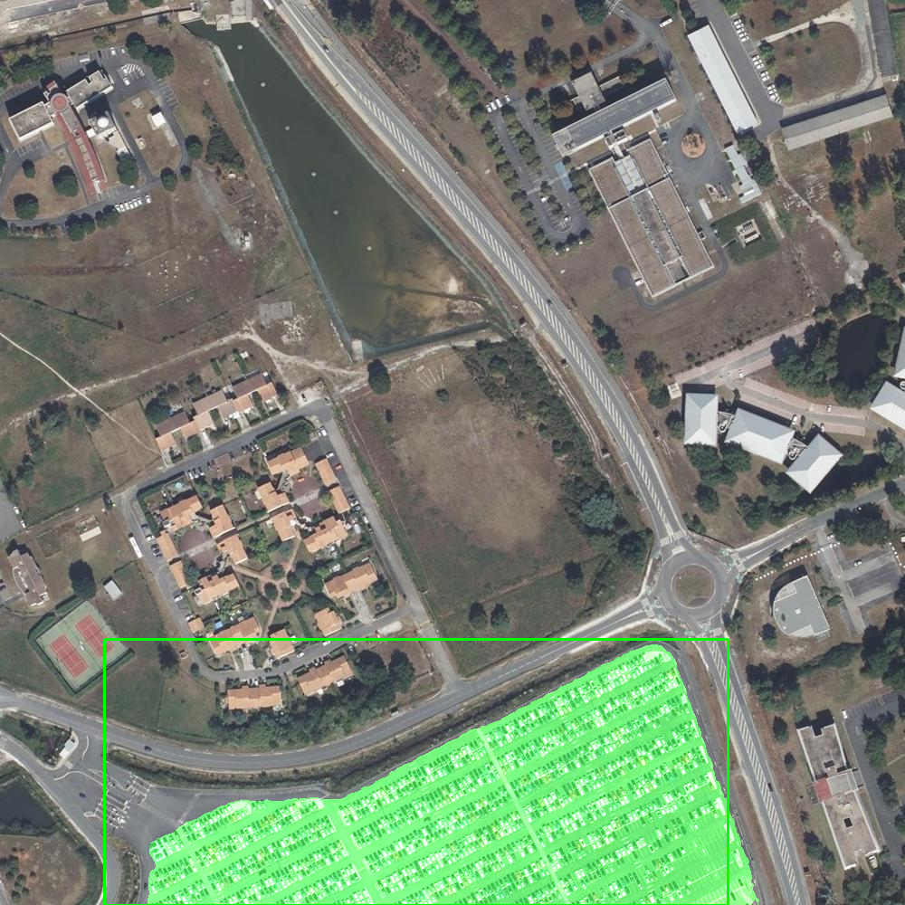

# Detecting Aerial Parking Lots for Sustainable and Smart Urban Planning

## A Brief History of AI-Based Object Detection from Aerial Images:

The ability to automatically detect objects in aerial images has evolved significantly over the years. Early approaches in the 1990s relied on feature-based methods, such as the Viola-Jones cascade detector using Haar-like features. These methods were effective for simple objects but struggled with complex scenes.

The advent of deep learning in the early 2010s revolutionized object detection. Pioneering models like YOLO introduced real-time, end-to-end approaches, achieving high accuracy and paving the way for further advancements. Today, sophisticated models like YOLOv8 and Meta's SAM leverage deep learning's power to deliver precise and efficient object detection in complex aerial images.

## The Challenge:

Growing urbanization puts pressure on parking, creating congestion and environmental issues. The ENR law requires the installation of photovoltaic canopies on aerial parking lots, but its effective enforcement requires accurate and reliable identification of these infrastructures.

## The Innovation:

We developed an algorithm for parking detection in aerial images combining the YOLO V8 (https://docs.ultralytics.com/) model with Meta's SAM (https://segment-anything.com/) algorithm enables accurate and efficient parking detection in complex aerial scenes.

Object detection in aerial images has evolved significantly with advancements in computer vision and machine learning. Early approaches in the 1990s relied on feature-based methods, such as the Viola-Jones cascade detector using Haar-like features. However, the advent of deep learning in the early 2010s revolutionized object detection with YOLO's real-time, end-to-end approach, delivering high accuracy.

Challenges in Parking Detection:

Detecting parking spaces in aerial images is a burgeoning research area with potential applications in parking management and smart urban planning. The task is challenging due to:

1. **Parking Variability**: Parking spaces come in different shapes, sizes, and layouts, making fixed feature extraction difficult.

2. **Shadows and Lighting**: Aerial images may have shadows and variable lighting conditions, altering texture and colors.

3. **Obstacles and Occlusion**: Urban environments with buildings, trees, or vehicles can obscure parking spaces.

4. **Parking Size**: Parking spaces may be small compared to the overall image, making detection at an appropriate scale crucial.

5. **Vehicle Diversity**: Parked vehicles vary in shape, size, and orientation, adding complexity.

## Training and results
We decided to train YOLO V8 on aerial images of parking (with an area > 1500m²) that we obtained by crossing the openstreetmap database and the IGN TOPO database ( https://geoservices.ign.fr/documentation/donnees/vector/bdtopo). 
We used data from 6 departments : Ain, Alpes-de-Haute-Provence, Bouches-du-Rhône, Dordogne, Hérault, Gard, Gironde, Lot and Var.

We have a dataset composed of 3743 images with 5844 parking for the train set, 562 images and 1114 parking for the validation set and finally 561 images and 1178 parking for the test set.

After several tests on different YOLOv8 size (small, medium and large) we obtain the best result with 200 epochs on the medium size model. On the test dataset we then have the next matrix :  
 

We have to keep in mind that our model detects parkings that are considered here as background (76) because they don't have any label because of our area limit.

## Download the model 

You can download the model on Hugging Face : https://huggingface.co/julien13/parking_detection/tree/main

## Examples :

 

  

