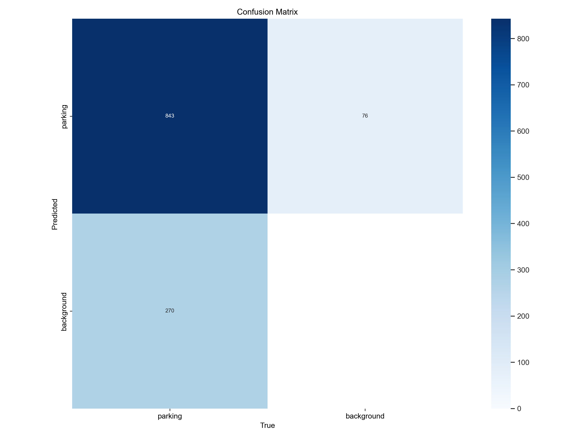
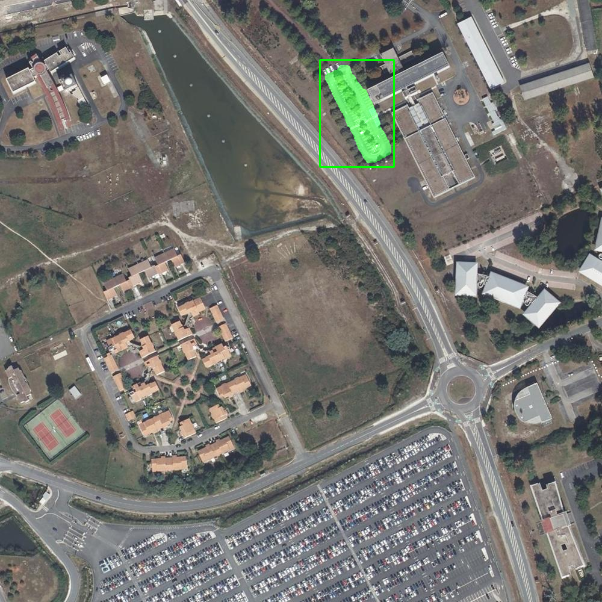

# parking detection
Parking Detection from Aerial Images (V1)

We developed an algorithm for parking detection in aerial images combining the YOLO V8 (https://docs.ultralytics.com/) model with Meta's SAM (https://segment-anything.com/) algorithm enables accurate and efficient parking detection in complex aerial scenes.

Object detection in aerial images has evolved significantly with advancements in computer vision and machine learning. Early approaches in the 1990s relied on feature-based methods, such as the Viola-Jones cascade detector using Haar-like features. However, the advent of deep learning in the early 2010s revolutionized object detection with YOLO's real-time, end-to-end approach, delivering high accuracy.

Challenges in Parking Detection:

Detecting parking spaces in aerial images is a burgeoning research area with potential applications in parking management and smart urban planning. The task is challenging due to:

1. **Parking Variability**: Parking spaces come in different shapes, sizes, and layouts, making fixed feature extraction difficult.

2. **Shadows and Lighting**: Aerial images may have shadows and variable lighting conditions, altering texture and colors.

3. **Obstacles and Occlusion**: Urban environments with buildings, trees, or vehicles can obscure parking spaces.

4. **Parking Size**: Parking spaces may be small compared to the overall image, making detection at an appropriate scale crucial.

5. **Vehicle Diversity**: Parked vehicles vary in shape, size, and orientation, adding complexity.

## training 
We decided to train YOLO V8 small on aerial images of parking that we obtained by crossing the openstreetmap database and the IGN TOPO database ( https://geoservices.ign.fr/documentation/donnees/vector/bdtopo). 
We used data from 3 departments : Bouches-du-Rhône, Var and Alpes-de-Haute-Provence.

We have a dataset composed of 829 images with 2384 parking for the train set, 179 images and 518 parking for the validation set and finally 177 images and 515 parking for the test set.

With 200 epochs we obtaint the next results : 

## download the model 

You can download the model on Hugging Face : https://huggingface.co/julien13/parking_detection/tree/main

## results
Examples :

   

  

